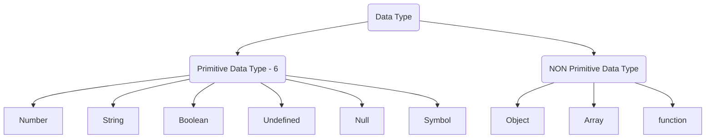

# Introdution to DataType

**It refers to the type the JavaScript variable holds in the memory.**

## **Analogy 1**

Imagine a `toolbox` (Memory) with different `compartments` for different tools (data).   
**_`Data types are like those compartments`_**, holding variables of specific kinds like `numbers`,` text`, or even `lists`.

## Analogy 2

**Imagine you're building a Lego castle:**

- **Data types are like the different types of Lego bricks**

  - You have **_`flat ones for floors`_**, **_`rounded ones for towers`_**, and **_`tiny ones for details`_**.
  - Each type `serves a specific purpose` and connects differently.

- **`Variables` are like the individual Lego bricks** ` + We use them to build our castle, but each brick needs to be the right type to fit and function properly.

## Importance

- **Without data types, our code would be like a pile of mismatched Lego pieces**
  - It wouldn't be clear what each piece represents, making it impossible to build anything meaningful.
- **Data types ensure our code is organized and efficient**
  - Just like using the right Lego brick for the job, using the right data type makes our code easier to `understand`, `maintain`, and `avoid errors`.

## Why learn it?

- **Understanding data types is like learning the Lego alphabet**
  - It's the foundation for building anything useful and creative with JavaScript.
- **Knowing data types allows we to**:
  - Write cleaner and more reliable code.
  - Debug errors more easily.
  - Solve problems creatively by using the right tools (data types) for the job.

# Types of DataType

1. **Primitive Type**
2. **Non-Primitive Type**

