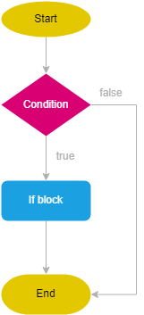
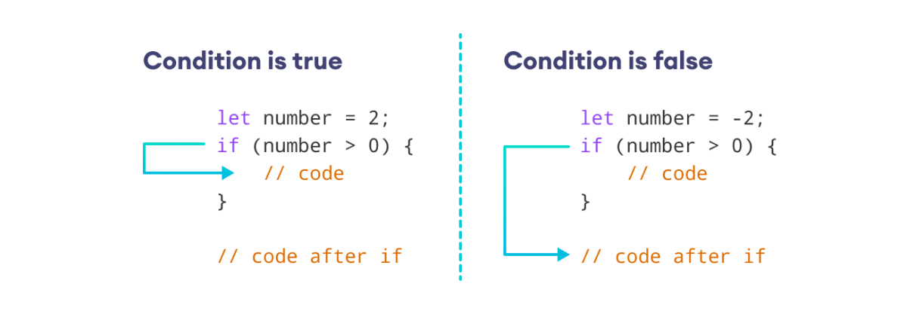

# JavaScript if Statement

We use the `if` keyword to execute code based on some specific condition.

The syntax of if statement is:

```js
if (condition) {
  // block of code
}
```

**The if keyword checks the condition inside the parentheses `()`.**

- If the condition is evaluated to **true**, the code inside `{ }` is **executed**.
- If the condition is evaluated to **false**, the code inside `{ }` is **skipped**.

> Note: The code inside `{ }` is also called the body of the if statement.
> If you have more than one statement to execute, you need to wrap them in a block using a pair of curly braces.

## how the if statement works.

<div>
  
</div>

**If the condition evaluates to a non-Boolean value, JavaScript implicitly converts its result to a Boolean value by calling the Boolean() function.**

<div>
  
</div>

## Examples

### 1. Program to check if the number is positive

```js
const number = prompt("Enter a number: ");

// check if number is greater than 0
if (number > 0) {
  // the body of the if statement
  console.log("positive number");
}

console.log("nice number");
```

**Sample Output 1**

```
Enter a number: 5
positive number
nice number
```

When we enter 5, the condition number > 0 evaluates to true. Thus, the body of the if statement is executed.

**Sample Output 2**

```
Enter a number: -1
nice number
```

When we enter -1, the condition `number > 0` evaluates to false.

- Hence, the body of the if statement is skipped.

## Nested If

It’s possible to use an if statement inside another if statement.

```js
let age = 16;
let state = "CA";

if (state == "CA") {
  if (age >= 16) {
    console.log("You can drive.");
  }
}
```

**Check if the state is 'CA' using an if statement.**

- If yes, check if the age is greater than 16 using a nested if statement and output a message to the console.

**In practice, you should avoid using nested if statements as much as possible.**

- For example, We can use the `&&` operator to combine the conditions and use an if statements as follows:

```js
let age = 16;
let state = "CA";

if (state == "CA" && age == 16) {
  console.log("You can drive.");
}
```
