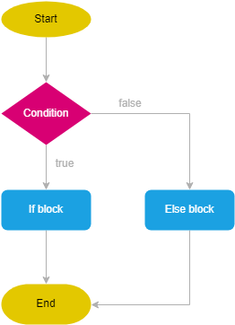
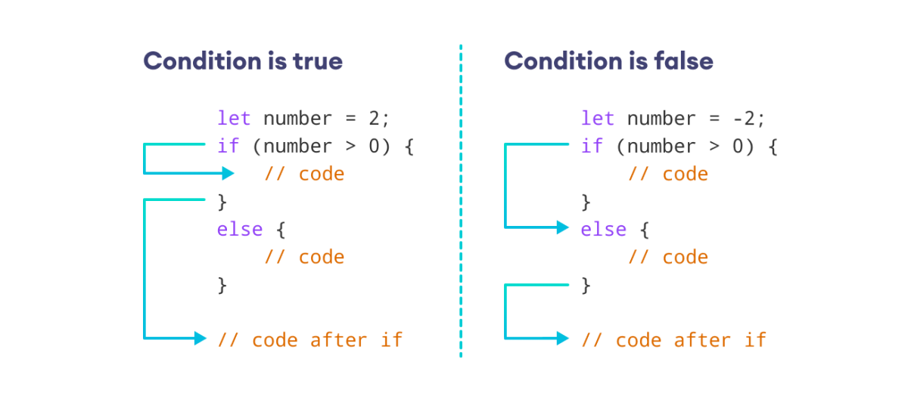

# JavaScript else Statement

**We use the `else` keyword to execute code when the condition specified in the preceding _if statement evaluates to false_.**

The syntax of the else statement is:

```js
if (condition) {
  // block of code
  // execute this if condition is true
} else {
  // block of code
  // execute this if condition is false
}
```

The `if...else` statement checks the `condition` and executes code in two ways:

1. If `condition is true`, the code inside `if` is executed.
   - And, the code inside `else` is **skipped**.
2. If `condition is false`, the code inside `if` is **skipped**.
   - Instead, the code inside `else` is **executed**.

<div >
  
</div>

The condition evaluates to a boolean value, which is **true** or **false**.

- However, if it evaluates to a non-boolean value, the `if...else` statement will convert it to the boolean value.
<div >
  
</div>

## Example

### 1. Check Minor or Adult

```js
let age = 17;

// if age is 18 or above, you are an adult
// otherwise, you are a minor

if (age >= 18) {
  console.log("You are an adult");
} else {
  console.log("You are a minor");
}

// Output: You are a minor
```

the `if` statement checks for the condition `age >= 18`.

- Since we set the value of age to `17`, the condition evaluates to **false**.

- Thus, the code inside if is skipped. And, code inside else is executed.

## When can we omit `{ }` in if…else statements?

We can omit `{ }` in `if…else` statements when we have a single line of code to execute.

```js
let num = 4;

// if condition
if (num % 2 == 0) console.log("even number");
else console.log("odd number");

// Output: even number
```
