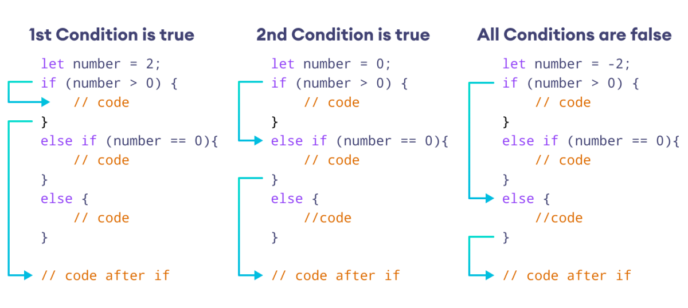

# JavaScript else if Statement

We can use the else if keyword to check for **multiple conditions**.

The syntax of the else if statement is:

```js
// check for first condition
if (condition1) {
  // if body
}

// check for second condition
else if (condition2) {
  // else if body
}

// if no condition matches
else {
  // else body
}
```

Here,

- First, the **condition** in the if statement is checked.
  - If the **condition** evaluates to **true**, the body of `if` is executed, and **the rest is skipped**.
    - Otherwise, the condition in the else if statement is checked.
  - If true, its body is executed and the rest is skipped.
  - Finally, if no condition matches, the block of code in else is executed.

<div >
  
</div>

<div >
  
</div>

## Example

```js
let rating = 4;

// rating of 2 or below is bad
// rating of 4 or above is good
// else, the rating is average

if (rating <= 2) {
  console.log("Bad rating");
} else if (rating >= 4) {
  console.log("Good rating!");
} else {
  console.log("Average rating");
}

// Output: Good rating!
```

We used the if statement to check for the condition `rating <= 2`.

- Likewise, we used the else if statement to check for another condition, `rating >= 4`.

- Since the else if condition is satisfied, the code inside it is executed.

## How to use multiple else if statements?

We can use the else if keyword as many times as we want.

```js
let alphabet = "c";

if (alphabet == "a") {
  console.log("a for apple");
}
// first else if statement
else if (alphabet == "b") {
  console.log("b for banana");
}
// second else if statement
else if (alphabet == "c") {
  console.log("c for cat");
}
// use more else if statements if needed
// otherwise, use an else statement
else {
  console.log("unknown alphabet");
}

// Output: c for cat
```

## Nested if...else Statement

```js
let marks = 60;

// outer if...else statement
// student passed if marks 40 or above
// otherwise, student failed

if (marks >= 40) {
  // inner if...else statement
  // Distinction if marks is 80 or above

  if (marks >= 80) {
    console.log("Distinction");
  } else {
    console.log("Passed");
  }
} else {
  console.log("Failed");
}

// Output: Passed
```

> Note: Avoid nesting multiple if…else statements within each other to maintain code readability and simplify debugging.
