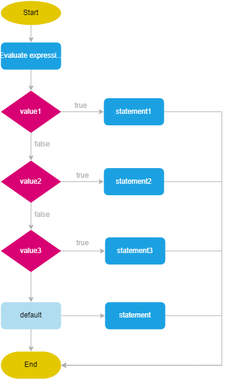

# Switch Statement in JavaScript

It is used to perform different actions based on different conditions.

- It's a more readable way to compare a variable against multiple values.

## Syntax

```javascript
switch (expression) {
  case value1:
    // code to be executed if expression === value1
    break;
  case value2:
    // code to be executed if expression === value2
    break;
  // add more cases as needed
  default:
  // code to be executed if expression doesn't match any case
}
```

- `expression`: The variable or value you want to compare.
- `case value`: The value you want to compare the expression against.
- `break`: Ends the current case block. If omitted, the next case block will be executed (fall-through).
- `default`: Optional. Executes if no matching case is found.

### How it works.

1. The expression inside the parentheses after the `switch` keyword is evaluated.
2. The result of the expression is compared with the `value1, value2, …` in case branches from top to bottom.
   - Switch statements use the strict comparison `===`.
3. In case the value of the expression is equal to the value introduced by the case word, execute the statement in the case branch.
   - It simply means that the break statement comes out of switch statement.
   - If without break statement, it will fall through the original case branch into the next.
   - If the result of the expression does not strictly equal any value, then the switch statement will execute the statement in the default branch.
     The switch statement, if it meets a match, stops further comparison of the rests of the case values with the result of the expression.

<div >
  
</div>

## `switch` statement is equivalent to the following `if-else-if` statement

```js
if (expression === value1) {
  statement1;
} else if (expression === value2) {
  statement2;
} else if (expression === value3) {
  statement3;
} else {
  statement;
}
```

## Example

```javascript
let fruit = "apple";

switch (fruit) {
  case "banana":
    console.log("Banana is yellow.");
    break;
  case "apple":
    console.log("Apple is red.");
    break;
  case "grape":
    console.log("Grape is purple.");
    break;
  default:
    console.log("Unknown fruit.");
}
// Output: Apple is red.
```

## When to Use the Switch Statement

1. **Multiple Possible Values**: When you need to compare a variable against multiple possible values.

   ```javascript
   let day = new Date().getDay();
   switch (day) {
     case 0:
       console.log("Sunday");
       break;
     case 1:
       console.log("Monday");
       break;
     // cases for other days...
     default:
       console.log("Invalid day");
   }
   ```

2. **Readability**: When having many `else if` statements would reduce readability. The `switch` statement can be more readable and maintainable.

3. **Non-overlapping Conditions**: When the conditions are discrete and non-overlapping. Each case should be mutually exclusive.

## When Not to Use the Switch Statement

1. **Complex Conditions**: When the conditions involve complex expressions or ranges.

   - `if-else` statements might be more appropriate for such scenarios.

2. **Logical Expressions**: When conditions involve logical operations (e.g., `&&`, `||`).

   - `if-else` statements are better suited for handling logical operations.

3. **Non-discrete Values**: When comparing ranges or complex conditions, use `if-else` for better clarity.

## Benefits of the Switch Statement

1. **Clarity and Readability**: For discrete and well-defined cases, `switch` statements can be more readable than a series of `if-else` statements.

   ```javascript
   switch (color) {
     case "red":
       console.log("Color is red");
       break;
     case "blue":
       console.log("Color is blue");
       break;
     // additional cases...
     default:
       console.log("Unknown color");
   }
   ```

2. **Easier Maintenance**: When adding new conditions, `switch` statements can be easier to maintain.

### Example Comparison

Using `if-else`:

```javascript
if (fruit === "banana") {
  console.log("Banana is yellow.");
} else if (fruit === "apple") {
  console.log("Apple is red.");
} else if (fruit === "grape") {
  console.log("Grape is purple.");
} else {
  console.log("Unknown fruit.");
}
```

Using `switch`:

```javascript
switch (fruit) {
  case "banana":
    console.log("Banana is yellow.");
    break;
  case "apple":
    console.log("Apple is red.");
    break;
  case "grape":
    console.log("Grape is purple.");
    break;
  default:
    console.log("Unknown fruit.");
}
```

In summary, the `switch` statement is a useful tool for handling multiple discrete conditions. It's particularly effective for improving readability and maintainability when comparing a variable against several possible values. For more complex or overlapping conditions, `if-else` statements might be a better choice.
