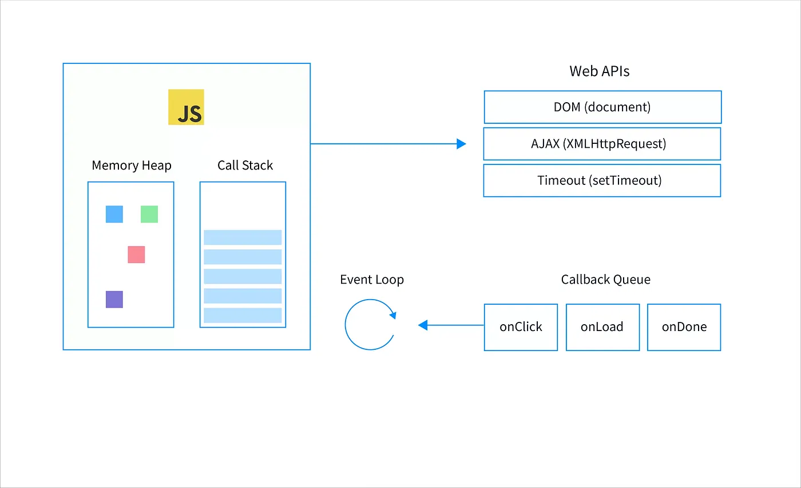

# Non-Blocking Code in JavaScript

JavaScript runs on a single thread, but it's designed to be non-blocking, allowing it to manage multiple tasks simultaneously without freezing the application.

- This is possible due to asynchronous programming and the event loop.

## The Event Loop: Core of JavaScript's Non-Blocking Nature in browser.

1. **Call Stack:**

   - JavaScript functions are placed on the call stack when invoked.
   - Once a function finishes executing, it is removed from the stack.

2. **Event Queue:**
   - Asynchronous tasks (like network requests, timers) are placed in the event queue once they are ready to be processed.
3. **Event Loop:**
   - Continuously monitors the call stack.
   - If the call stack is empty, it takes the next event from the event queue and pushes it onto the call stack for execution.

<div style="text-align: center">
  
</div>

### **Event Loop in JavaScript**

- Manages asynchronous operations and events.
- Enables non-blocking code execution, improving task handling efficiency.
- Vital for responsiveness and concurrency in web browsers.

## **Key Components**:

1. **Event Queue**:

   - Stores asynchronous events like user interactions, HTTP responses, and timers.

2. **Call Stack**:

   - A data structure that tracks currently executing code and function calls.

3. **Event Loop**:

   - Monitors the call stack and event queue.
   - When the call stack is empty, it pushes the first event from the queue onto the call stack for execution.

4. **Callback Execution**:

   - Executes the callback function from the event queue.
   - If the callback contains asynchronous code, it schedules it to run later and continues processing other events.

5. **Non-blocking Behavior**:

   - Allows asynchronous operations to run without blocking the main thread.

6. **Completion**:

   - The event loop runs as long as there are events or pending callbacks.
   - Terminates when the event queue is empty.

## **Example**

```javascript
console.log("Start");

setTimeout(() => {
  console.log("Timeout callback");
}, 2000);

console.log("End");
```

**Output**:

- "Start"
- "End"
- "Timeout callback" (after a 2-second delay)

**Conclusion**:

- The event loop's non-blocking, event-driven approach is crucial for building responsive, high-performance web applications.

## Asynchronous Programming Techniques

JavaScript provides several ways to handle asynchronous operations, allowing you to write non-blocking code:

### 1. **Callbacks:**

- Functions passed as arguments to other functions.
- They execute once an asynchronous task is complete.

```javascript
function fetchData(url, callback) {
  setTimeout(() => {
    const data = { name: "John Doe", age: 30 };
    callback(data);
  }, 2000);
}

fetchData("https://example.com/data", (data) => {
  console.log(data); // Output: { name: 'John Doe', age: 30 }
});
```

### 2. **Promises:**

- Objects that represent the eventual completion (or failure) of an asynchronous operation.
- `then` and `catch` methods handle resolved or rejected states.

```javascript
function fetchData(url) {
  return new Promise((resolve, reject) => {
    setTimeout(() => {
      const data = { name: "John Doe", age: 30 };
      resolve(data);
    }, 2000);
  });
}

fetchData("https://example.com/data")
  .then((data) => console.log(data)) // Output: { name: 'John Doe', age: 30 }
  .catch((error) => console.error(error));
```

### 3. **Async/Await:**

- Syntactic sugar over Promises, making asynchronous code look synchronous.
- `await` pauses execution until the Promise is resolved or rejected.

```javascript
async function fetchData(url) {
  const response = await fetch(url);
  const data = await response.json();
  return data;
}

fetchData("https://example.com/data")
  .then((data) => console.log(data))
  .catch((error) => console.error(error));
```
