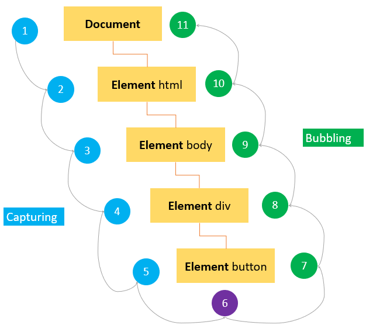

# Event flow in JavaScript

It refers to the order in which events are handled when they occur on nested HTML elements.

- It determines which event listeners are triggered first and how the event propagates through the DOM tree.

## Two main concepts in event flow:

### 1. Event Target:

This is the specific element in the DOM where the event initially occurs.

- For example, if you click a button, the button element is the event target.

### 2. Event Propagation

This refers to how the event travels up the DOM tree from the target element towards the document window.

## Two main types of event propagation

1. **Event Bubbling (default)**

   - This is the most common type of event propagation.
   - In bubbling, the event first triggers on the event target and then propagates up through its parent elements until it reaches the document window.
   - This means that if an element has a click event listener, and it's nested inside another element that also has a click event listener, the click event will first trigger the listener on the inner element and then the listener on the outer element.
   <div>
    
   </div>

2. **Event Capturing**
   - This is less commonly used than bubbling. In capturing, the event first triggers on the outermost element that contains the event target and then propagates down to the target element itself.
   - Event capturing can be useful in specific scenarios, but it's generally considered less intuitive than bubbling.
    <div>
       
   </div>

## Event Propagation Phases

<div style="text-align: center;">
       
</div>

1. **Capturing Phase** (_Event Capturing_): The event starts from the window and propagates down to the target element.
2. **Target Phase**: The event reaches the target element.
3. **Bubbling Phase**(_Event Bubbling_): The event propagates back up from the target element to the window.

## Adding Event Listeners in Different Phases

- **Event Capturing**: You can add an event listener that handles the event during the capturing phase by passing `true` as the third argument to `addEventListener`.
- **Event Bubbling**: By default, events are handled during the bubbling phase, but you can explicitly set it by passing `false` (or omitting the third argument) to `addEventListener`.

## Example: Capturing vs Bubbling

Consider the following HTML structure:

```html
<!DOCTYPE html>
<html lang="en">
  <head>
    <meta charset="UTF-8" />
    <title>Event Propagation</title>
  </head>
  <body>
    <div id="outer">
      <button id="inner">Click Me!</button>
    </div>
    <script src="script.js"></script>
  </body>
</html>
```

**JavaScript:**

```javascript
const outerDiv = document.getElementById("outer");
const innerButton = document.getElementById("inner");

// Event listener for capturing phase
outerDiv.addEventListener(
  "click",
  function (event) {
    console.log("Outer div captured click");
  },
  true
);

// Event listener for bubbling phase
innerButton.addEventListener(
  "click",
  function (event) {
    console.log("Inner button bubbled click");
  },
  false
);

// Event listener for capturing phase
innerButton.addEventListener(
  "click",
  function (event) {
    console.log("Inner button captured click");
  },
  true
);

// Event listener for bubbling phase
outerDiv.addEventListener(
  "click",
  function (event) {
    console.log("Outer div bubbled click");
  },
  false
);
```

## Event Propagation in Action

- **Clicking the Button (`innerButton`)**:
  - During the capturing phase, the `outerDiv`'s capturing listener (`'Outer div captured click'`) will trigger first.
  - Then, the `innerButton`'s capturing listener (`'Inner button captured click'`) will trigger.
  - Next, the `innerButton`'s bubbling listener (`'Inner button bubbled click'`) will trigger.
  - Finally, the `outerDiv`'s bubbling listener (`'Outer div bubbled click'`) will trigger.

## Stopping Event Propagation

You can stop the event from propagating further using `event.stopPropagation()`.

**Example:**

```javascript
innerButton.addEventListener(
  "click",
  function (event) {
    console.log("Inner button clicked, stopping propagation");
    event.stopPropagation(); // Stop further propagation
  },
  false
);
```

In this example, clicking the `innerButton` will prevent the event from propagating to the `outerDiv`'s bubbling listener.

## Ignoring an Event

To prevent the default action of an event (like navigating to a link when it's clicked), you can use `event.preventDefault()`.

**Example:**

```html
<a href="https://example.com" id="myLink">Go to Example</a>
```

```javascript
const myLink = document.getElementById("myLink");

myLink.addEventListener(
  "click",
  function (event) {
    event.preventDefault(); // Prevent the default action (navigation)
    console.log("Default action prevented");
  },
  false
);
```
