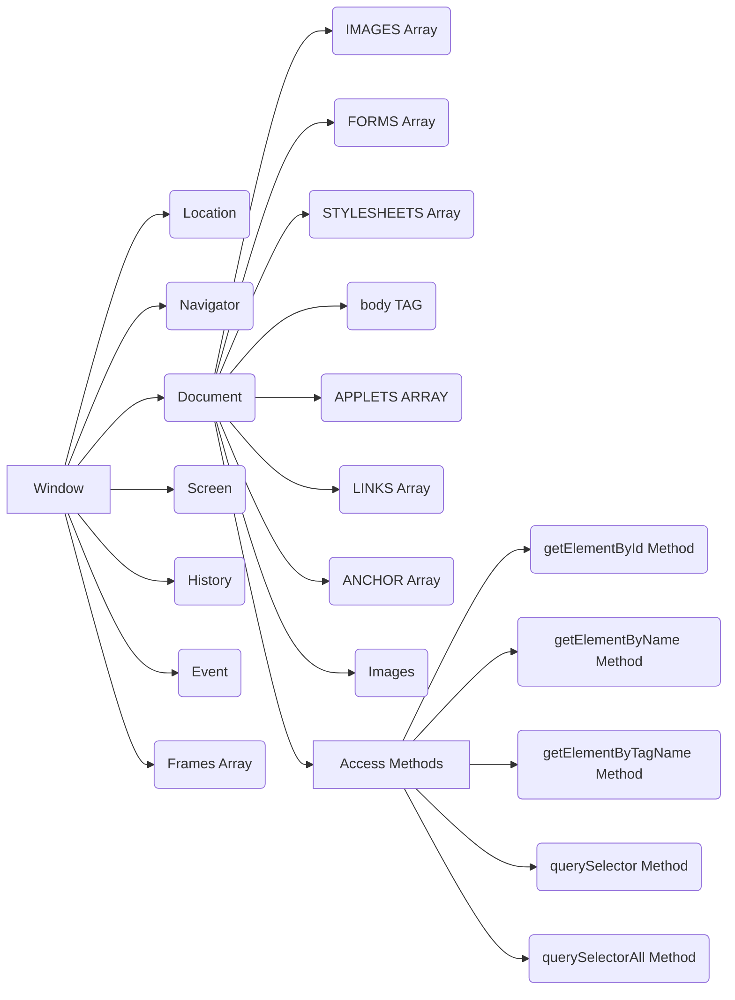

# Introduction

**DOM is an API (Application programming interface) for web documents, such as HTML, XML, or SVG.**

- An API is a **_set of rules and protocols that allows different software applications to communicate and interact with each other_**.
- In the case of the DOM, it **_provides a standardized `interface` that allows programs to `access` and `manipulate` the content, structure, and style of web documents_**.
- This API is at the `root` of the description of a page and serves as a base for scripting on the web.
- DOM model is an **`object-oriented representation of the web page`**, which can be modified with a scripting language such as JavaScript.
- While it originated in the context of web browsers and JavaScript, the DOM concept can be implemented in various programming languages like **python**, **JavaScript**, **C#**, **Java**, etc.

> **The DOM represents the document as nodes and objects; that way, programming languages can interact with the page.**

**It representing the structure of a web page or document as a hierarchical tree of objects.**

- • The DOM provides a way for `programs` and `scripts` to **_access and manipulate the content, structure, and style of a document_**.

**When a web page is loaded in a browser, the browser constructs a DOM representation of the page, which can then be accessed and manipulated using scripting languages such as JavaScript.**

- Each element in the HTML document, such as **headings**, **paragraphs**, **images**, and **links**, is represented as a `node` in the `DOM tree`.
- These `nodes` can be **accessed** and **modified** programmatically, allowing developers to dynamically change the content and appearance of a web page.

**The DOM is built using multiple APIs that work together.**

- The core DOM defines the entities describing any document and the objects within it.

# Why DOM is required?

**The Document Object Model (DOM) is essential because while HTML organizes web pages and JavaScript adds functionality to them, `JavaScript cannot directly interpret HTML documents` when a browser loads them.**

- Therefore, the `DOM acts as an intermediary representation of the HTML document`, structured as objects.
- JavaScript can understand and interact with the DOM, but it cannot directly comprehend HTML tags like `<h1>` or `
`. Instead, JavaScript can manipulate objects within the DOM, enabling it to access and modify elements using various functions. Thus, the DOM facilitates dynamic interaction and manipulation of web page content by JavaScript.

# Structure of DOM

**DOM can be likened to a Tree or even multiple trees, forming a structure model that represents a document. **

- Each branch of the tree leads to a node, which contains objects.
- Nodes can have event listeners attached to them, which are activated when specific events occur.

**An essential characteristic of DOM structure models is their structural `isomorphism`.**

- This means that if two different DOM implementations are used to create a representation of the same document, they will generate an identical structure model, with the same objects and relationships.

