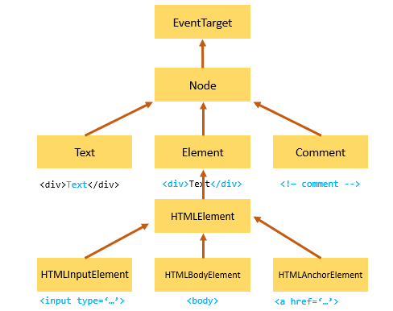
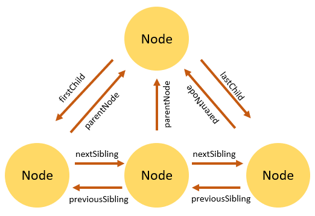

# Node Relationships

Any node has relationships to other nodes in the DOM tree.

- These relationships are all the same as those described by a traditional family tree.
- It is used when navigating or manipulating a document.
- For example, `<body>` is a child node of the `<html>` node and the `<html>` is the parent of the `<body>` node.

- The `<body>` node is a sibling of the <head> node because they share the same immediate parent; that is, the <html> element.

## Types of Relationship

<div style="text-align: center;">
    
</div>

### 1. Parent and Child Nodes

**A `parent node` is a node that contains other nodes.**

- the `<div>` is the parent of the `<p>`.

```html
<div>
  <p></p>
</div>
```

**Child Node**

- A node that is contained within another node.
- In the above example, the <p> is a child of the <div>.

**Properties to use**

1. **parentNode**: Returns the parent node of the specified node.
2. **childNodes**: Returns a collection of the child nodes of the specified node.

### 2. Sibling Nodes

**Sibling Nodes**:
Nodes that share the same parent.

- the `<p>` and `<span>` are siblings.

```html
<div>
  <p></p>
  <span></span>
  <h1></h1>
</div>
```

**Previous Sibling**
The node immediately before another node at the same level.

**Next Sibling**:
The node immediately after another node at the same level.

**Properties to use:**

1. **previousSibling**: Returns the node immediately before the specified one.
2. **nextSibling**: Returns the node immediately after the specified one.

### 3. Ancestors and Descendants

**Ancestor Nodes**:
Nodes that are higher in the hierarchy, encompassing parents, grandparents, etc.
**Descendant Nodes**: Nodes that are lower in the hierarchy, including children, grandchildren, etc.

<div style="text-align: center;">
    
</div>

0------

## Examples

**Consider the following HTML structure**

```html
<div id="grandparent">
  <div id="parent">
    <p id="child">Hello, world!</p>
  </div>
</div>
```

**JavaScript code to demonstrate node relationships**

```javascript
// Getting the elements
const grandparent = document.getElementById("grandparent");
const parent = document.getElementById("parent");
const child = document.getElementById("child");

// Parent and Child Nodes
console.log(child.parentNode); // Logs: <div id="parent">
console.log(parent.childNodes); // Logs: NodeList(1) [ <p id="child"> ]

// Sibling Nodes
const sibling = document.createElement("span");
sibling.id = "sibling";
parent.appendChild(sibling);
console.log(child.nextSibling); // Logs: <span id="sibling">
console.log(sibling.previousSibling); // Logs: <p id="child">

// Ancestor Nodes
console.log(child.parentNode); // Logs: <div id="parent">
console.log(child.parentNode.parentNode); // Logs: <div id="grandparent">

// Descendant Nodes
console.log(grandparent.querySelectorAll("*")); // Logs: NodeList(2) [ <div id="parent">, <p id="child"> ]
```
