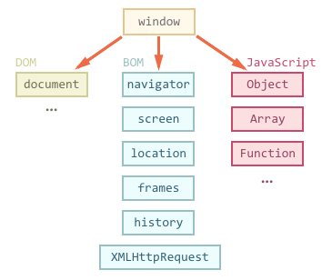

# Introduction

BOM – stands for Browser Object Model. Now, by a browser, we mean a window in any browser, be it Firefox, Chrome, or Internet Explorer.

Till now, you've heard regarding the Document Object Model of JavaScript. Which is used to represent the content of a document related to the web. But, BOM and DOM are different things. Let's see how?

It is the Browser Object Model that allows JavaScript to communicate with the browser on anything other than the contents of the page.

# BOM (Browser Object Model)

As previously told, BOM allows Javascript to talk to the browser on matters other than the content of the page.

- It includes: `Navigator`, `History`, `Screen`, etc.

> **BOM is a browser-specific convention that refers to all the objects of the web browser and allows for accessing and manipulating the window of the browser.**

Since there is no standard for BOM, each browser supports it differently.

- Among all the features that are not directly related to the content itself of the page, developers can use the BOM to perform operations such as moving the window and editing the text in the status bar.

    </img>

## Types of Browser Object Model

The Browser Object Model that can be used in JavaScript are listed below:

1. **Windows Object Model**
2. **Screen Object Model**
3. **History Object Model**
4. **Navigator Object Model**
5. **Location Object Model**
